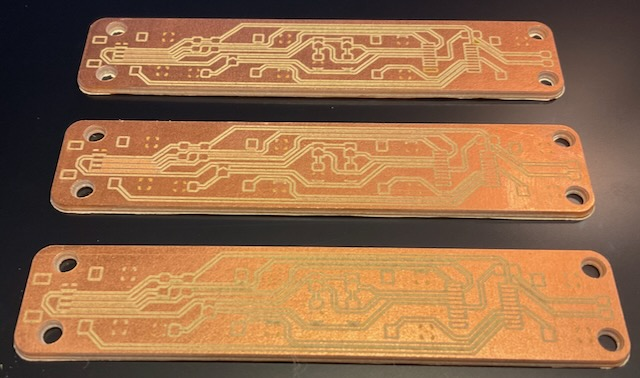

CNC + Fiber Laser PCB 



You can make a PCB with a CNC.

You can make a PCB with a Fiber Laser.

By matching the appropriate technology to the task you can make a high quality small batches of PCBs quickly.

CNCs are excellent for making deep cuts and drilling holes.

Fiber Lasers excel at making fine pitch traces quickly. 

This method:
* avoids charring
* avoids excess fumes
* avoids uneven depth cuts
* allows for vias
* double sided (for schizzle)
* frees up valuable laser time
* avoids overdriving low power fiber lasers

```
         +-----------------+
         |   PCB Material  |
         +-----------------+
                  |
         +--------+--------+
         |                 |
         V                 V
+----------------+   +---------------+
|  CNC Machine   |   | Fiber Laser   |
| (Edge & Drilling)  | (Traces)     |
+----------------+   +---------------+
         |                 |
         +--------+--------+
                  |
         +-----------------+
         |   Completed PCB |
         +-----------------+
```

Laser Settings
===
|      Type       | Power (%) | Speed (mm/s) | Pass (#x) | Time | Desc                                                                 |
|:---------------:|:---------:|:------------:|:---------:|:----:|:--------------------------------------------------------------------:|
| Trace Cut       | 80        | 3000         | 25        | 30s  | just right                                                         |
| Trace Engrave   | 100       | 6000         | 10        | 12m  | pretty clean                                                       |
| Stencil Cut     | 80        | 300          | 120       | 2m   | Yep! Looks cooked, but was almost 100% through with no damage to brass |
| pcb cut         | 100       | 100          | 160       | 5m   | some smoke (use CNC if possible)                                   |


Materials
===

|                 Item                                    | Price | Source |
|:-------------------------------------------------------:|:-----:|:------:|
| [xTool F1 Ultra 20W Fiber](https://amzn.to/41h2cZH)      | 4200  | Amazon |
| [Andonstar AD246S-M Digital Microscope](https://amzn.to/41iweML) | 140  | Amazon |
| [MHP50](https://amzn.to/4gItVXV)                         | 140   | Amazon |
| [10 Pcs Single Sided Copper Clad PCB](https://amzn.to/4jXkF4V) | 7     | Amazon |
| [Low Temp Solder Paste](https://amzn.to/42WLXSY)         | 21    | Amazon |
| [Brass 0.1mm Stencil Material](https://amzn.to/42XMIes)  | 10    | Amazon |
| [Gloves Anti-Static](https://amzn.to/3X36cKU)            | 17     | Amazon |
| [PCB Stencil Jig Knobs](https://amzn.to/42TYsPh)         | 10    | Amazon |
| [PCB Stencil Jig Feet](https://amzn.to/4i0Jrzc)           | 10    | Amazon |
| [PCB Stencil Jig Knurled Nuts](https://amzn.to/3X5jerg)    | 10    | Amazon |

Acknowledgements
===
Special thanks to both of these excellent folks for sharing their work in this area
* [Stephen Hawes Fiber Laser PCB Fab](https://github.com/sphawes/fiber-laser-pcb-fab)
* [makermoekoe StencilJig3D](https://github.com/makermoekoe/StencilJig3D/tree/main)
